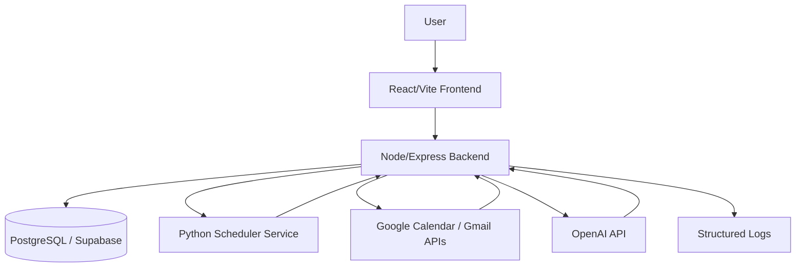
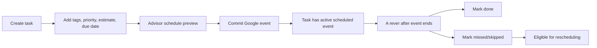
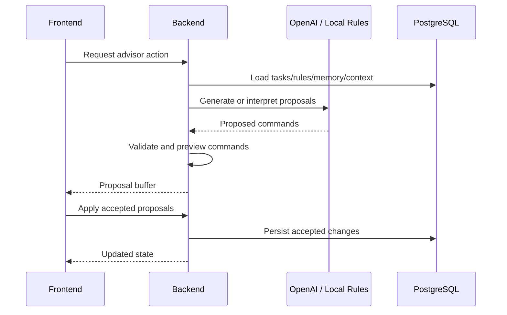
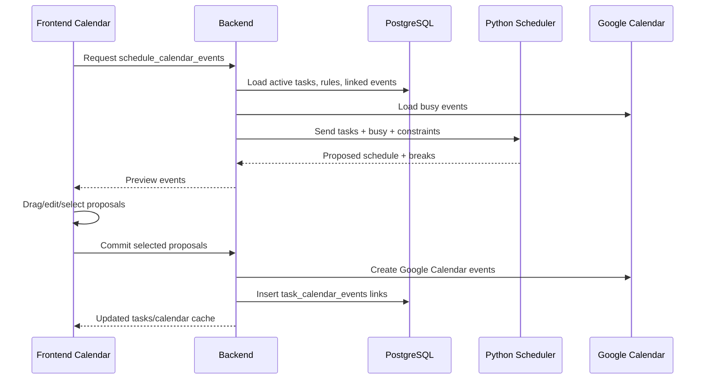

# System Design

## Component Diagram

## Responsibilities

| Component | Responsibilities |
| --- | --- |
| Frontend | Views, forms, proposal review, calendar preview, drag/drop adjustments, settings, scheduled review UI. |
| Backend | API, validation, persistence, Advisor orchestration, Google integration, scheduler request preparation, productivity events. |
| PostgreSQL/Supabase | Durable storage for tasks, tags, relations, scheduler rules, calendar event links, review state, settings, and logs. |
| Python Scheduler | Converts tasks, busy windows, constraints, and preferences into proposed calendar slots. |
| Google Calendar | External source of busy events and destination for committed scheduled events. |
| OpenAI | Optional interpretation/generation for Advisor proposals and natural-language scheduler rules. |

## Main Flows

### Task Lifecycle

### Advisor Proposal Flow

### Calendar Scheduling Flow

## Design Principles

- The backend owns domain validation and side effects.
- The frontend can preview and edit proposals, but committed behavior is enforced server-side.
- Google Calendar is external state; internal task scheduling state comes from linked `task_calendar_events`.
- Natural-language rules are converted into structured constraints before they affect scheduling.
- Durable history matters: reviews, activities, and productivity events are stored instead of inferred only from current state.
