# Data Model

This document is the navigation map for the persisted domain model. It is organized by domain first, then by table/model, so it is easier to find the part of the system you are working on.

## Quick Map

| Domain | Main Tables | Purpose |
| --- | --- | --- |
| Tasks | `tasks`, `task_checklist_items`, `task_relations`, `task_activity`, `task_activity_revisions` | Core work items, blockers, checklist, and history. |
| Tags | `tags`, `task_tags` | Reusable task labels and tag filtering. |
| Calendar Scheduling | `task_calendar_events`, `scheduler_rules`, `scheduler_constraints`, `scheduler_constraint_types`, `scheduler_schedule_batches`, `scheduler_reserved_blocks` | Scheduling rules, proposed/committed calendar state, and task-event links. |
| Periodic Routines | `periodic_tasks`, `periodic_task_constraints`, `periodic_task_occurrences` | Reusable routine definitions and occurrence history. |
| Advisor / AI Memory | `advisor_feedback`, `advisor_memory_rules` | Structured proposal feedback and reusable learned rules. |
| Notes | `shared_notes`, `shared_note_tags`, `task_shared_notes` | Reusable notes attached to tasks. |
| Google | `google_connections`, `google_oauth_states` | OAuth connection and temporary OAuth state. |
| Productivity | `productivity_events` | XP/accounting event stream. |
| Quick Queue | `quick_queue_items` | Short-term reminders / inbox queue. |
| Settings | `app_settings` | App behavior and UI customization. |

## ERD

```mermaid
erDiagram
  tasks ||--o{ task_checklist_items : has
  tasks ||--o{ task_activity : has
  task_activity ||--o{ task_activity_revisions : has
  tasks ||--o{ task_relations : source
  tasks ||--o{ task_relations : target

  tasks ||--o{ task_tags : has
  tags ||--o{ task_tags : used_by

  tasks ||--o{ task_calendar_events : scheduled_as
  tasks ||--o{ productivity_events : may_reference
  task_calendar_events ||--o{ productivity_events : may_reference
  quick_queue_items ||--o{ productivity_events : may_reference

  scheduler_rules ||--o{ scheduler_constraints : owns
  scheduler_constraint_types ||--o{ scheduler_constraints : defines
  scheduler_schedule_batches ||--o{ scheduler_reserved_blocks : contains

  periodic_tasks ||--o{ periodic_task_constraints : has
  periodic_tasks ||--o{ periodic_task_occurrences : has

  shared_notes ||--o{ shared_note_tags : has
  shared_notes ||--o{ task_shared_notes : attaches
  tasks ||--o{ task_shared_notes : has

  google_connections ||--o{ google_oauth_states : uses
```

## Domain: Tasks

### `tasks`

**Purpose:** primary work item record.

**Important Fields**

| Field | Meaning |
| --- | --- |
| `id` | Task id. |
| `title` | Main task title. |
| `notes` | Long-form task notes. |
| `priority` | User priority, currently 1-4. |
| `status` | `new`, `in_progress`, `waiting`, `done`, `cancelled`. |
| `due_date_time` | Deadline only. Not a scheduled calendar appointment. |
| `estimated_minutes` | Expected task duration. |
| `is_favorite` | Favorite flag. |
| `requested_by` | Optional requester/source context. |
| `blocked_reason` | Optional explanation for blocked work. |
| `completed_at`, `cancelled_at`, `archived_at` | Lifecycle timestamps. |

**Relations**

- Has many `task_checklist_items`.
- Has many `task_activity` rows.
- Has many `task_tags` rows.
- Has many source/target `task_relations`.
- Has many `task_calendar_events`.
- May be referenced by `productivity_events`.
- May attach `shared_notes` through `task_shared_notes`.

**Rules**

- `due_date_time` is a deadline, not scheduled time.
- A task cannot be completed while unfinished dependencies/checklist items block it.
- Archived tasks are hidden from normal active views.
- Scheduling state is derived from `task_calendar_events`, not from `due_date_time`.

### `task_checklist_items`

**Purpose:** ordered checklist items belonging to a task.

**Important Fields**

| Field | Meaning |
| --- | --- |
| `task_id` | Parent task. |
| `title` | Checklist item text. |
| `is_done` | Completion state. |
| `position` | Ordering within task. |
| `completed_at` | Completion timestamp. |

**Rules**

- Unfinished checklist items block marking the task as `done`.

### `task_relations`

**Purpose:** task-to-task relationships, including blockers/dependencies.

**Important Fields**

| Field | Meaning |
| --- | --- |
| `task_id` | Source task. |
| `related_task_id` | Target task. |
| `relation_type` | Relationship type, such as `blocked_by`, `blocks`, `relates_to`, `duplicates`, `parent_of`, `child_of`. |

**Rules**

- `blocked_by` dependencies block completion until related tasks are done.
- Inverse relationships are synchronized by backend logic where applicable.

### `task_activity`

**Purpose:** human-readable history and progress notes for a task.

**Important Fields**

| Field | Meaning |
| --- | --- |
| `task_id` | Parent task. |
| `type` | Activity type: created/status/note/dependency/archive depending on current usage. |
| `message` | Human-readable text. |
| `from_status`, `to_status` | Status transition metadata. |
| `edited_at` | Edit timestamp for progress notes. |

**Used For**

- task creation;
- status changes;
- dependency changes;
- progress notes;
- scheduled review notes;
- archive events.

### `task_activity_revisions`

**Purpose:** preserves edited progress/activity text history.

**Important Fields**

| Field | Meaning |
| --- | --- |
| `activity_id` | Parent activity entry. |
| `message` | Previous message. |
| `replaced_at` | When it was replaced. |

## Domain: Tags

### `tags`

**Purpose:** canonical tag catalog.

**Important Fields**

| Field | Meaning |
| --- | --- |
| `name` | Canonical tag text. |
| `is_active` | Soft-deactivation flag. |

**Rules**

- Tags are soft-deactivated, not physically deleted.
- Using a deactivated tag again reactivates it.

### `task_tags`

**Purpose:** many-to-many link between tasks and tags.

**Important Fields**

| Field | Meaning |
| --- | --- |
| `task_id` | Task. |
| `tag_id` | Tag. |

## Domain: Calendar Scheduling

### `task_calendar_events`

**Purpose:** association between a task and a real Google Calendar event.

**Important Fields**

| Field | Meaning |
| --- | --- |
| `task_id` | Linked task. |
| `google_event_id` | Google Calendar event id. |
| `calendar_id` | Google calendar id. |
| `summary` | Event title. |
| `start_at`, `end_at` | Scheduled event window. |
| `html_link` | Google Calendar link. |
| `review_status` | `completed`, `missed`, `skipped`, or null. |
| `reviewed_at` | Review timestamp. |
| `review_note` | Free-form review note. |
| `review_feedback` | Structured review feedback. |
| `xp_delta` | XP awarded/penalized during review. |

**Rules**

- Future/current unreviewed event means the task is effectively scheduled.
- Past unreviewed event for an open task belongs in `A rever`.
- Past reviewed event is history and does not block new scheduling.
- This table does not represent the task deadline.
- Committing a calendar event inserts/updates this association and must not mutate `tasks.due_date_time`.

### `scheduler_rules`

**Purpose:** natural-language scheduling rules persisted after interpretation.

**Important Fields**

| Field | Meaning |
| --- | --- |
| `text` | Original user text. |
| `interpretation` | Human-readable interpretation. |
| `status` | Rule status, normally `active`. |
| `enabled` | Whether it participates in scheduling. |
| `confidence` | Interpreter confidence. |
| `model` | Model/source used. |
| `raw_response` | Raw structured interpretation/debug data. |

### `scheduler_constraints`

**Purpose:** structured constraints derived from scheduler rules.

**Important Fields**

| Field | Meaning |
| --- | --- |
| `rule_id` | Parent scheduler rule. |
| `type` | Constraint type, e.g. `allowed_window`, `priority_boost`. |
| `scope` | Which tasks it applies to. |
| `payload` | Constraint parameters. |
| `hard` | Mandatory vs preference. |
| `enabled` | Whether this constraint is active. |

**Scope Examples**

- `allTasks`
- `tags`
- `titleIncludes`
- `taskIds`
- `statuses`
- `priorities`

**Rules**

- `hard=true` means the scheduler should treat the constraint as mandatory where supported.
- Soft constraints influence slot ranking/preference, not validity.

### `scheduler_constraint_types`

**Purpose:** catalog/metadata for supported scheduler constraint types.

**Used For**

- validation;
- UI editing hints;
- normalizing manually edited constraints.

### `scheduler_schedule_batches`

**Purpose:** historical container for committed scheduler-reserved blocks.

**Current Note**

- Breaks are now created as explicit `Pausa` calendar events in the normal proposal flow.
- This table can still exist for historical/legacy reserved block support.

### `scheduler_reserved_blocks`

**Purpose:** legacy/persisted reserved blocks linked to a scheduler batch.

**Current Note**

- New break handling should prefer explicit calendar events.

## Domain: Periodic Routines

### `periodic_tasks`

**Purpose:** reusable routine definitions, not duplicated normal tasks.

**Important Fields**

| Field | Meaning |
| --- | --- |
| `title` | Routine title. |
| `notes` | Optional notes. |
| `tags` | Routine tags. |
| `priority` | Routine priority. |
| `estimated_minutes` | Default occurrence duration. |
| `period` | `week` or `month`. |
| `target_count` | Desired occurrences per period. |
| `hard_constraints` | Structured hard constraints. |
| `preferences` | Structured preferences. |
| `active` | Whether included in scheduling. |

### `periodic_task_constraints`

**Purpose:** one-off or extra constraints for periodic routines.

**Important Fields**

| Field | Meaning |
| --- | --- |
| `periodic_task_id` | Parent routine. |
| `type` | Constraint type. |
| `scope` | Scope metadata. |
| `payload` | Constraint payload. |
| `hard` | Mandatory vs preference. |
| `active` | Whether enabled. |
| `expires_at` | Optional expiry. |

### `periodic_task_occurrences`

**Purpose:** history of committed periodic schedule events.

**Important Fields**

| Field | Meaning |
| --- | --- |
| `periodic_task_id` | Parent routine. |
| `scheduled_start`, `scheduled_end` | Occurrence schedule. |
| `calendar_id`, `google_event_id`, `html_link` | Google Calendar linkage. |
| `status` | `scheduled`, `completed`, `skipped`, `cancelled`, etc. |

**Rules**

- Accepted periodic calendar proposals create occurrences.
- Occurrences can be updated without creating normal task duplicates.

## Domain: Advisor / AI Memory

### `advisor_feedback`

**Purpose:** raw structured feedback from Advisor proposal/interaction review.

**Used For**

- audit/debug of feedback;
- future memory/rule generation.

### `advisor_memory_rules`

**Purpose:** reusable learned Advisor behavior derived from feedback.

**Important Fields**

| Field | Meaning |
| --- | --- |
| `rule_type` | Memory category. |
| `title_fingerprint` | Optional title/context fingerprint. |
| `action` | Advisor action it applies to. |
| `rule` | Structured behavior/pattern. |
| `support_count` | Number of supporting feedback events. |
| `last_feedback_at` | Last reinforcement timestamp. |

## Domain: Shared Notes

### `shared_notes`

**Purpose:** reusable notes that can be attached to tasks.

**Important Fields**

| Field | Meaning |
| --- | --- |
| `title` | Note title. |
| `body` | Note content. |
| `archived_at` | Archive timestamp. |

### `shared_note_tags`

**Purpose:** tags for shared notes.

### `task_shared_notes`

**Purpose:** many-to-many relation between tasks and shared notes.

## Domain: Google

### `google_connections`

**Purpose:** encrypted Google OAuth connection state.

**Important Fields**

| Field | Meaning |
| --- | --- |
| `account_email` | Connected Google account. |
| `scopes` | Granted scopes. |
| `encrypted_tokens` | Stored encrypted OAuth tokens. |
| `expires_at` | Connection expiry timestamp. |

**Rules**

- One active connection is stored.
- Calendar/Gmail actions require relevant OAuth scopes.

### `google_oauth_states`

**Purpose:** temporary OAuth state records for login/connect flows.

## Domain: Productivity

### `productivity_events`

**Purpose:** append-only XP/accounting event stream.

**Important Fields**

| Field | Meaning |
| --- | --- |
| `event_type` | Event kind, e.g. task completed/scheduled/reviewed. |
| `xp` | Positive/negative XP delta. |
| `task_id` | Optional task reference. |
| `quick_queue_item_id` | Optional quick queue reference. |
| `checklist_item_id` | Optional checklist reference. |
| `calendar_event_id` | Optional task calendar event reference. |
| `metadata` | Extra JSON context. |
| `occurred_at` | Event time. |

## Domain: Quick Queue

### `quick_queue_items`

**Purpose:** short-term queue/inbox items that can later become tasks.

**Important Fields**

| Field | Meaning |
| --- | --- |
| `text` | Queue item text. |
| `is_done` | Done flag. |
| `position` | Ordering. |

## Domain: Settings

### `app_settings`

**Purpose:** single JSON settings document for app behavior and customization.

**Includes**

- productivity settings;
- calendar settings;
- UI colors and compact mode.

## Derived Runtime Shapes

### Task Scheduling State

Tasks returned by APIs may include `calendarEvents`. The frontend derives:

| Derived Field | Source | Meaning |
| --- | --- | --- |
| `scheduled` | next future/current unreviewed `task_calendar_events` row | Task has active scheduled event. |
| `scheduledStart` | active linked event | Start of next scheduled event. |
| `scheduledEnd` | active linked event | End of next scheduled event. |
| `reviewPending` | past unreviewed linked event for open task | Task should appear in `A rever`. |

These are not substitutes for `dueDateTime`.

## Update Checklist

When changing this model:

- Add/adjust the Supabase migration.
- Update the relevant domain section in this file.
- Update [Scheduling Model](./03-scheduling-model.md) if scheduling semantics changed.
- Update [Backend API](./07-backend-api.md) if response/request shapes changed.
- Add a decision in [Decisions](./09-decisions.md) if the change affects system semantics.