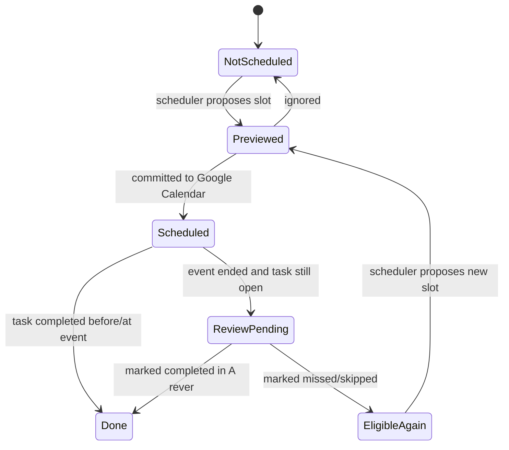
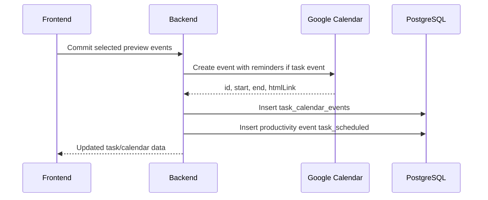

# Scheduling Model

## Concepts

| Concept | Meaning |
| --- | --- |
| Due date | Deadline stored on the task as `dueDateTime`. |
| Preview event | Proposed calendar event shown in the frontend before commit. |
| Scheduled event | Real Google Calendar event linked in `task_calendar_events`. |
| Break event | Explicit `Pausa` Google Calendar event created by scheduler break rules. |
| Periodic occurrence | Scheduled instance of a periodic routine. |
| Review item | Past scheduled event for an open task that still needs user confirmation. |

## State Diagram

## Eligibility

A task is eligible for calendar scheduling when:

- it is not archived;
- status is `new` or `in_progress`;
- it has no future/current unreviewed linked calendar event;
- hard constraints can be satisfied;
- it is not excluded by request context.

A task is not blocked by old linked events. Old unreviewed events are handled by the review pool.

## Constraint Semantics

| Constraint | Hard behavior | Soft behavior |
| --- | --- | --- |
| `allowed_window` | Only valid inside allowed slots. | Not recommended; use as hard. |
| `allowed_date` | Only valid on exact date/window. | Not recommended; use as hard. |
| `preferred_window` | Invalid as hard unless explicitly supported. | Prefer matching slots. |
| `priority_boost` | Should be invalid or treated as mandatory if hard. | Prefer matching slots/ranking. |
| `blocked_window` | Exclude blocked slots. | Avoid if possible. |
| `break_after_task` | Creates break after long task when applicable. | Prefer break but may be skipped. |
| `break_after_work_block` | Creates break after continuous work block. | Prefer break but may be skipped. |
| `daily_limit` | Restricts occurrences per day. | Prefer spread. |

## Slot Selection Rule

Expected scheduler ranking:

1. Filter valid slots using hard constraints and busy events.
2. Among available preferred slots, choose the earliest suitable slot.
3. Use non-preferred slots only when no preferred slot is available or a stronger constraint requires it.
4. Never let a soft preference change the task deadline.

## Commit Semantics

Rules:

- Committing a proposal does not update `dueDateTime`.
- Normal task events get a Google popup reminder 30 minutes before start.
- `Pausa` events do not get reminders.
- After commit, Google Calendar cache is cleared/refreshed so the UI sees the new events.
- Users can commit one proposal, selected custom proposals, all proposals for a day, or the full batch.

## Scheduled Review

A task calendar event enters review when:

- the event is linked to a task;
- event end is in the past;
- task is not `done`, `cancelled`, or archived;
- event has no `review_status`.

Review actions:

- `completed`: task becomes `done`, XP is awarded, event review is stored.
- `missed`: task stays open, penalty XP is stored, event review is stored, task can be rescheduled.
- `skipped`: task stays open, neutral XP by default, event review is stored, task can be rescheduled.

Feedback and notes are stored on the event review for future analysis.
