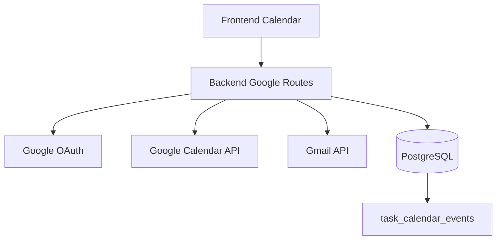

# Google Calendar

## Integration Diagram

## OAuth

The backend stores one encrypted Google connection in `google_connections`. Calendar/Gmail actions require the matching OAuth scopes.

Key routes:

- `GET /google/status`
- `POST /google/oauth/url`
- `GET /google/oauth/callback`
- `DELETE /google/connection`

## Calendar Reads And Cache

`GET /google/calendar/events` accepts:

- `date=YYYY-MM-DD`
- `start=YYYY-MM-DD&end=YYYY-MM-DD`
- repeated `calendarId` values

Calendar reads use a short TTL cache to reduce repeated Google API calls. Pressing `Atualizar` refreshes from Google Calendar. Creating or deleting calendar events clears relevant cache entries.

## Event Creation

Events are created by:

- committing Advisor schedule proposals;
- manually creating a task calendar event;
- committing explicit break proposals.

Task event rules:

- create Google Calendar event;
- insert/update `task_calendar_events` association;
- create productivity event `task_scheduled`;
- do not update task `dueDateTime`;
- add popup reminder 30 minutes before start.

Break event rules:

- create explicit event named `Pausa`;
- do not link to a task;
- do not add reminders.

## Data Ownership

Google Calendar owns the external event. The app owns the relationship between tasks and events through `task_calendar_events`.

A task is scheduled only if it has a future/current unreviewed linked event. Due dates are not inferred from Google Calendar events.
