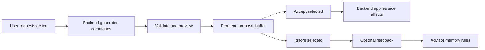

# AI Advisor

## Principles

- The Advisor is approval-based.
- The frontend asks for known actions, not free-form chat mutation.
- The backend owns prompts, validation, preview generation, and side effects.
- Feedback is structured and can become reusable advisor memory.

## Supported Actions

```text
suggest_tags
suggest_due_dates
priority_management
schedule_calendar_events
```

## Proposal Lifecycle



## Scheduler Rules vs Advisor Memory

| Area | Purpose | Storage |
| --- | --- | --- |
| Advisor memory | Learns from proposal feedback to improve future suggestions. | `advisor_memory_rules` |
| Scheduler rules | Natural-language scheduling constraints/preferences. | `scheduler_rules`, `scheduler_constraints` |
| Periodic constraints | Routine-specific scheduling constraints. | `periodic_task_constraints` |

## Calendar Scheduling Advisor

For `schedule_calendar_events`, the Advisor delegates actual slot selection to the Python scheduler service after the backend builds the request with:

- eligible tasks;
- active scheduler rules;
- task-specific constraints;
- periodic candidates;
- Google busy events;
- fixed user-moved preview constraints.

The frontend then shows preview proposals. Committed proposals become Google Calendar events.
