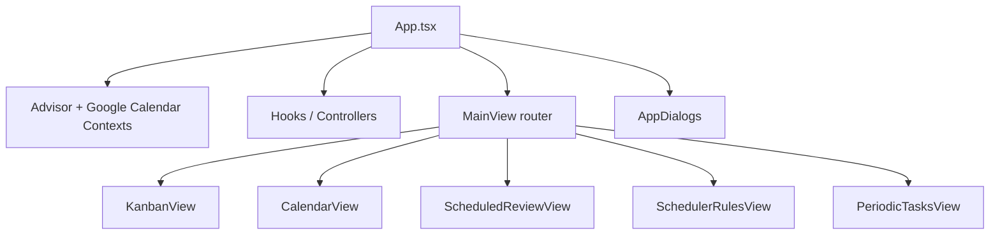

# Frontend Architecture

## High-Level Structure

## Main Responsibilities

| Area | Files | Responsibility |
| --- | --- | --- |
| App shell | `App.tsx`, `MainView.tsx`, `ViewTabs.tsx` | Routing, global panels, view selection. |
| Task actions | `useTaskActions.ts` | Update, archive, checklist, notes, scheduled review. |
| Advisor | `AdvisorPanel*`, `useAdvisorController.ts` | Proposal previews, filtering, feedback, commits. |
| Google Calendar | `CalendarView.tsx`, `CalendarWeekView.tsx`, `useGoogleCalendar.ts` | Calendar events, previews, drag/drop, cache refresh. |
| Scheduling helpers | `utils/taskScheduling.ts` | Derive active scheduled event and review-pending events. |
| Task detail | `TaskDetails.tsx` | Editable task fields, scheduling section, applicable rules. |

## UI Rule

The frontend should not treat `dueDateTime` as a scheduled appointment. It should display due date and scheduled event separately.
