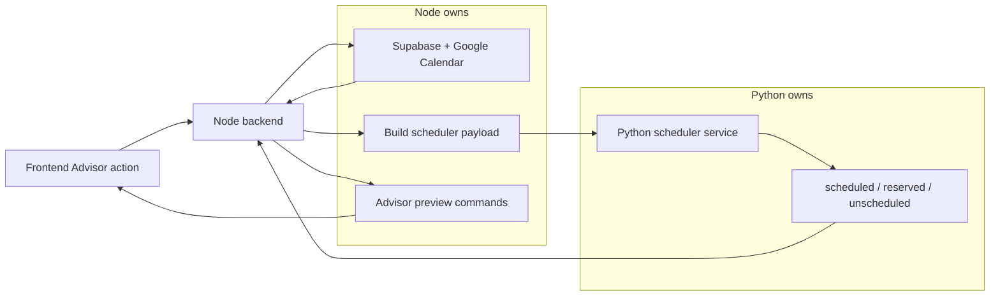
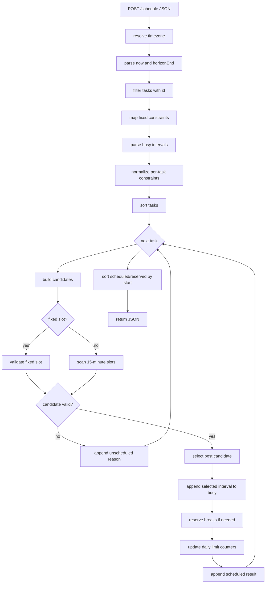

# Python Scheduler Service

The Python scheduler service is the deterministic scheduling engine used by the Advisor when the user asks for calendar scheduling proposals.

It does not talk to Supabase, Google Calendar, OpenAI, or the frontend. It receives a compact JSON payload from the Node backend, chooses slots, and returns scheduled items, reserved break blocks, and rejected tasks.

## Responsibility Boundary



Node owns:

- fetching eligible tasks
- excluding tasks that already have future/current scheduled events
- fetching Google busy events
- adding committed reserved busy blocks
- expanding active scheduler rules into per-task constraints
- converting periodic routines into scheduler candidates
- converting Python output into Advisor `create_calendar_event` preview commands
- committing accepted events later

Python owns:

- parsing the scheduler payload
- normalizing timezones and datetimes
- scanning candidate slots in 15-minute increments
- enforcing fixed slots, busy intervals, working hours, due dates, and hard constraints
- scoring soft/preferred constraints
- choosing deterministic slots
- returning break reservations and unscheduled reasons

## HTTP Surface

Implemented in [app.py](../python-scheduler-service/app.py).

Endpoints:

- `GET /health` returns `{ "status": "ok" }`.
- `POST /schedule` receives the scheduler payload and returns the scheduling result.

Runtime defaults:

- host: `127.0.0.1`
- port: `8000`
- override host with `SCHEDULER_HOST`
- override port with `SCHEDULER_PORT`

The Node backend calls it through [schedulerClient.ts](../backend/ai/schedulerClient.ts):

- `SCHEDULER_SERVICE_URL`, default `http://127.0.0.1:8000`
- `SCHEDULER_REQUEST_TIMEOUT_MS`, default `30000`

If Python returns a non-2xx response, Node maps it to a backend error with status `502`.

## Request Payload

Shape sent to `POST /schedule`:

```json
{
  "now": "2026-07-16T20:50:52.501Z",
  "horizonEnd": "2026-09-01T18:00:00.000Z",
  "timeZone": "Europe/Lisbon",
  "busy": [
    {
      "calendarId": "primary",
      "summary": "Working pt 1",
      "start": "2026-07-17T09:00:00+01:00",
      "end": "2026-07-17T13:00:00+01:00",
      "calendarSummary": "Rotina"
    }
  ],
  "constraints": [
    {
      "taskId": "task-a",
      "fixedStart": "2026-07-18T08:00:00Z",
      "fixedEnd": "2026-07-18T08:30:00Z"
    }
  ],
  "taskConstraints": {
    "task-a": [
      {
        "id": "constraint-id",
        "ruleId": "rule-id",
        "type": "priority_boost",
        "payload": {
          "days": [6, 7],
          "startTime": "08:00",
          "endTime": "12:00"
        },
        "hard": false
      }
    ]
  },
  "tasks": [
    {
      "id": "task-a",
      "title": "Adicionar CI/CD local",
      "durationMinutes": 30,
      "dueDateTime": "2026-07-18T08:00:00.000Z",
      "periodicTaskId": null
    }
  ]
}
```

Important fields:

| Field | Owner | Meaning |
| --- | --- | --- |
| `now` | Node | Earliest scheduling moment. Python rounds it up to the next 15-minute slot. |
| `horizonEnd` | Node | Last possible end time to search. |
| `timeZone` | Node/Python | Timezone used for working hours, weekdays, dates, and `HH:mm` windows. |
| `busy` | Node | Existing occupied intervals from Google Calendar, reserved blocks, and routine spacing. |
| `constraints` | Node | Manual/fixed constraints. These become exact fixed slots per task. |
| `taskConstraints` | Node | Per-task scheduler constraints already resolved from rules/scopes. |
| `tasks` | Node | Compact task candidates. Python only requires `id`; duration/due date are optional. |

Aliases supported by Python:

- `timezone` may be used instead of `timeZone`.
- `calendarAvailability` may be used instead of `busy`.
- Fixed constraints may use `start`/`end` instead of `fixedStart`/`fixedEnd`.

## Response Payload

```json
{
  "scheduled": [
    {
      "taskId": "task-a",
      "start": "2026-07-18T07:30:00Z",
      "end": "2026-07-18T08:00:00Z",
      "appliedConstraintIds": ["constraint-id"]
    }
  ],
  "reserved": [
    {
      "type": "break",
      "start": "2026-07-18T09:00:00Z",
      "end": "2026-07-18T09:15:00Z",
      "reason": "break_after_task",
      "sourceRuleId": "rule-id",
      "sourceConstraintId": "constraint-id"
    }
  ],
  "unscheduled": [
    {
      "taskId": "task-b",
      "reason": "no available slot before due date",
      "blockingConstraintIds": ["constraint-id"]
    }
  ]
}
```

Semantics:

- `scheduled` are task/periodic candidates that got a slot.
- `reserved` are generated break blocks. Node later turns these into `Pausa` preview events.
- `unscheduled` are candidates that could not be placed.
- `appliedConstraintIds` lets Node explain which rules affected the scheduled result.
- `blockingConstraintIds` appears for fixed-slot constraint failures when known.

## Internal Processing Flow

Implemented mainly in [scheduler.py](../python-scheduler-service/scheduler.py).



## Time Model

Implemented in [scheduler_time.py](../python-scheduler-service/scheduler_time.py) and [scheduler_types.py](../python-scheduler-service/scheduler_types.py).

Constants:

| Constant | Value | Meaning |
| --- | --- | --- |
| `SLOT_MINUTES` | `15` | Candidate slots move in 15-minute increments. |
| `WORKDAY_START_HOUR` | `8` | Earliest local working time. |
| `WORKDAY_END_HOUR` | `22` | Latest local working time. |
| `DEFAULT_DURATION_MINUTES` | `30` | Used when a task has no valid duration. |
| `MAX_DURATION_MINUTES` | `240` | Maximum task duration accepted by scheduler. |

Datetime rules:

- Incoming ISO strings with `Z` are parsed as UTC.
- Naive datetimes are assumed to be in the request timezone.
- Everything is converted to the target timezone internally.
- Output is always UTC ISO with `Z`.
- `now` is rounded up with `ceil_to_slot`.
- `HH:mm` payload windows are interpreted in the target timezone.

Working hours are currently fixed in Python: `08:00` to `22:00`. The service does not yet read app settings for working hours.

## Task Ordering

Before scheduling, Python sorts tasks by:

1. fixed/manual constrained tasks first
2. task priority bias derived from constraints
3. earlier `dueDateTime`
4. original task order from the payload

The priority bias is not the task's numeric priority. Node already chooses and orders eligible tasks. Python only applies extra ordering pressure from constraints such as:

- `priority_boost`
- `preferred_window`
- hard `allowed_date`
- hard `allowed_window`
- hard `daily_limit`

This is why a hard or strong temporal constraint can pull a task earlier than a flexible task.

## Candidate Generation

For each task, Python builds at most one best candidate.

Fixed slot path:

1. read `fixedStart`/`fixedEnd`
2. reject if in the past
3. reject if outside working hours
4. reject if it exceeds due date
5. reject if it overlaps busy time
6. evaluate task constraints
7. return the fixed candidate if valid

Flexible path:

1. start cursor at rounded `now`
2. keep cursor inside working hours
3. compute `end = cursor + duration`
4. stop if `end` exceeds `horizonEnd`
5. stop this task if `end` exceeds `dueDateTime`
6. skip over busy overlaps by jumping cursor to the busy interval end
7. evaluate task constraints
8. keep the best candidate by score, then earliest slot, then original task order
9. move cursor by 15 minutes

Best candidate sort key:

```txt
(score, slot, original_task_order)
```

Lower score is better. Soft preferences subtract from score, so they win over default slots.

## Busy Intervals

Python treats every `busy` item as an occupied interval if it has valid `start` and `end` and `end > start`.

The scheduler ignores extra metadata such as:

- `calendarId`
- `summary`
- `calendarSummary`

Those fields are useful in Node/debug UI, but Python only needs the interval.

After a task is selected, Python appends the selected interval to the in-memory busy list. That prevents later tasks in the same run from overlapping it.

Generated breaks are also appended to busy when they can be placed.

## Constraint Semantics

Implemented in [scheduler_constraints.py](../python-scheduler-service/scheduler_constraints.py).

Payload conventions:

- `days` uses ISO weekday numbers: Monday `1`, Sunday `7`.
- `daysOfMonth` matches calendar day numbers.
- `startTime`/`endTime` use `HH:mm`.
- `hard: true` or missing `hard` means the constraint can reject a slot.
- `hard: false` means the constraint is soft unless the type is inherently blocking.

Supported constraints:

| Type | Hard behavior | Soft behavior |
| --- | --- | --- |
| `blocked_window` | Rejects overlapping slots. | Currently only blocks when hard. |
| `allowed_window` | Only allows slots fully inside the window. | No scoring behavior currently. |
| `allowed_date` | Only allows slots on exact date, optionally inside a time window. | No scoring behavior currently. |
| `avoid_day` | Rejects matching weekdays. | No scoring behavior currently. |
| `min_duration` | Rejects tasks shorter than `minutes`. | No scoring behavior currently. |
| `max_duration` | Rejects tasks longer than `minutes`. | No scoring behavior currently. |
| `preferred_window` | If hard, behaves like required preferred window. | Matching slots get better score. |
| `priority_boost` | If hard, behaves like required temporal match. | Matching slots get better score. |
| `daily_limit` | Rejects when matching daily count is already at max. | No scoring behavior currently. |
| `break_after_task` | Does not reject slots. | Produces reserved break after selected task. |
| `break_after_work_block` | Does not reject slots. | Produces reserved break after continuous work threshold. |

Important behavior:

- `priority_boost hard=false` prefers matching slots but can fall back to non-matching slots if needed.
- `priority_boost hard=true` behaves like a required temporal match.
- `preferred_window hard=false` prefers matching slots.
- `preferred_window hard=true` behaves like an `allowed_window` for that payload.
- `allowed_window hard=true` restricts valid slots.
- `allowed_date hard=true` restricts valid dates.

## Scoring

Candidate score starts at `0`.

Soft matching constraints subtract from score:

- `preferred_window`: subtracts `payload.weight` or `100`.
- `priority_boost`: subtracts `payload.weight`, or a default weight.

Default `priority_boost` weight:

- if `weight` exists: use it
- if payload has `days` or `daysOfMonth`: `10000`
- otherwise: `100`

Temporal ordering bias for tasks can be even stronger for hard windows/dates, so constrained tasks are considered before flexible tasks.

## Break Handling

Implemented in [scheduler_breaks.py](../python-scheduler-service/scheduler_breaks.py).

Breaks are not scheduled as tasks. They are returned in `reserved` and also added to the busy list so following tasks cannot overlap them.

### `break_after_task`

Payload:

```json
{
  "breakMinutes": 15,
  "minDurationMinutes": 60
}
```

Behavior:

- after a selected task, if task duration is at least `minDurationMinutes`, try to reserve a break starting at task end
- break duration is clamped to valid scheduler duration bounds
- if the break overlaps busy time or exceeds working hours, it is skipped

### `break_after_work_block`

Payload:

```json
{
  "workMinutes": 90,
  "breakMinutes": 15
}
```

Behavior:

- tracks continuous scheduled task minutes
- continuity means `selected.start == previous_task_end`
- when the accumulated work reaches `workMinutes`, try to reserve a break
- if break is placed, the continuous work counter resets
- if tasks are not chronological/contiguous, the counter resets

## Daily Limits

`daily_limit` uses a per-constraint/day counter.

Payload:

```json
{
  "max": 1,
  "initialCounts": {
    "2026-07-20": 1
  }
}
```

Behavior:

- if candidate matches the temporal payload, count existing `initialCounts[YYYY-MM-DD]`
- add counts from candidates already selected in this same scheduler run
- reject when count is already `>= max`
- after selecting a matching candidate, increment the in-memory counter

Node uses this for periodic routines such as max occurrences per day.

## Periodic Routine Candidates

Python does not know the full periodic routine model.

Node converts each remaining required occurrence into a fake task id such as:

```txt
periodic:<periodicTaskId>:1
```

Node also attaches routine constraints to that candidate, for example:

- hard `allowed_window`
- hard `daily_limit`
- fixed occurrence constraints
- spacing busy intervals

Python schedules it like any other task. After the response, Node converts scheduled periodic candidates into periodic calendar preview commands and later persists them as `periodic_task_occurrences` when committed.

## Common Unscheduled Reasons

Reasons returned by Python include:

| Reason | Meaning |
| --- | --- |
| `fixed slot is in the past` | Fixed/manual slot starts before `now`. |
| `fixed slot is outside working hours` | Fixed slot is outside `08:00-22:00`. |
| `fixed slot exceeds due date` | Fixed slot ends after task `dueDateTime`. |
| `fixed slot overlaps busy time` | Fixed slot conflicts with an existing busy interval. |
| `fixed slot violates scheduler constraints` | Fixed slot fails hard task constraints. |
| `due date is in the past` | Task deadline is before/equal to `now`. |
| `no available slot before due date` | Flexible task has a due date but no valid slot before it. |
| `no available future slot` | Flexible task has no due date but no slot before horizon end. |
| `no valid slot selected` | Candidate generation succeeded but selection returned nothing. This should be rare. |

## What Python Does Not Do

Python does not:

- fetch tasks
- fetch Google Calendar events
- know task tags/title scopes
- interpret natural language rules
- know users/accounts
- write database rows
- create Google Calendar events
- decide whether a task is eligible based on existing linked events
- update `dueDateTime`
- persist breaks
- generate user-facing explanations

Those responsibilities belong to the Node backend and frontend.

## Tests

Behavior is covered by [test_scheduler.py](../python-scheduler-service/test_scheduler.py).

Current test coverage includes:

- nearest available slots
- fixed constraints
- `calendarAvailability` alias
- timezone working hours
- larger task batches
- blocked windows
- hard allowed windows ordering
- priority boost ordering and hard behavior
- preferred windows
- day-of-month priority boost
- daily limits and initial counts
- allowed date
- work-block break behavior
- break after task behavior
- due date conflicts

Run with:

```bash
cd python-scheduler-service
python -m unittest discover -s . -p "test_*.py"
```

## Operational Notes

- The service uses `ThreadingHTTPServer`; it is simple and suitable for local/dev usage.
- There is no request authentication at the Python layer. It should be kept behind the Node backend/private network.
- There is no persistent state in Python. Each `/schedule` call is independent.
- The deterministic greedy algorithm is explainable and fast, but it is not a global optimizer.
- If global optimality becomes important later, the contract can stay similar while the internal algorithm changes.