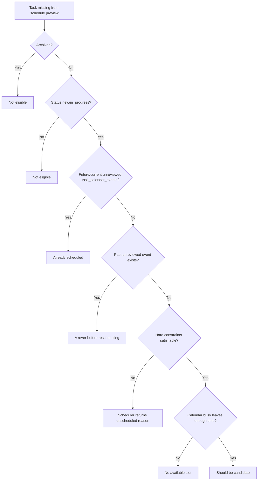
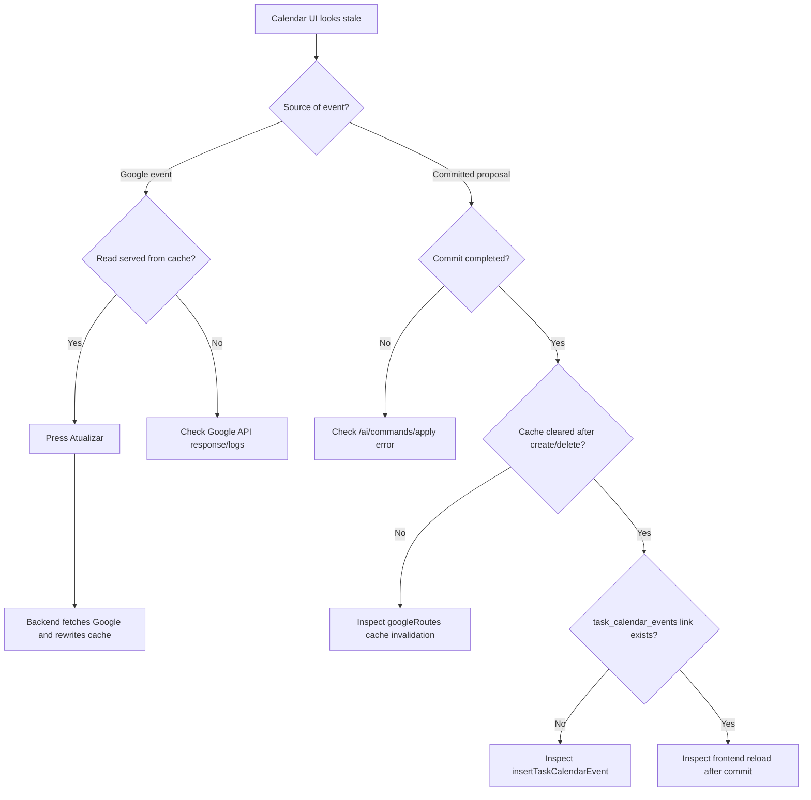
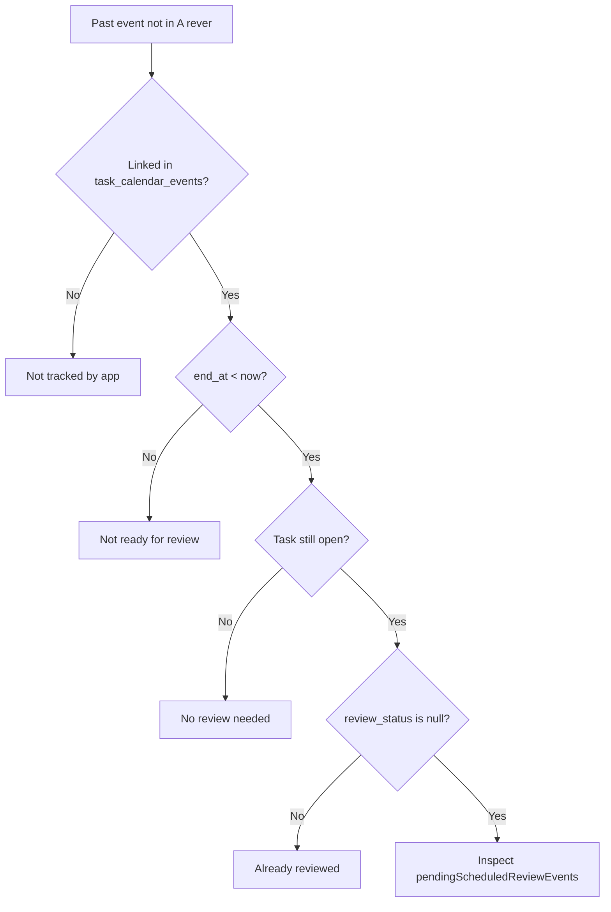
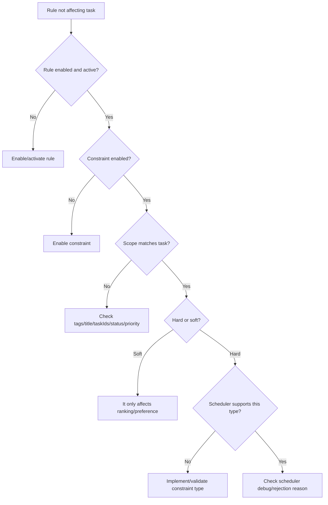
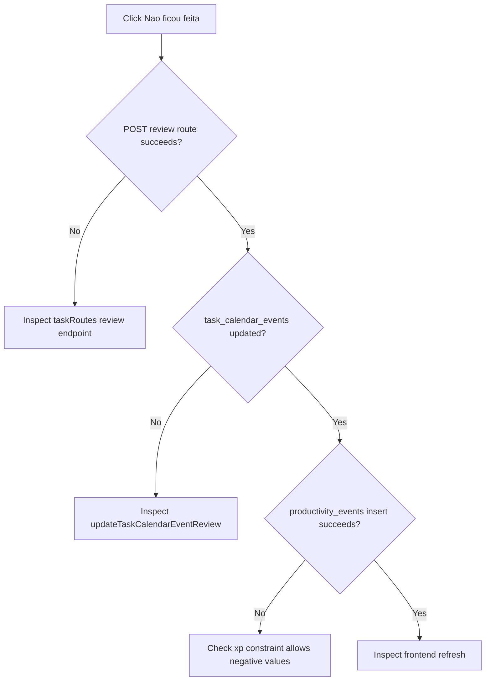

# Diagnostic Flows

This document shows non-happy-path flows. Use it when behavior looks wrong and you need to decide which layer to inspect first.

## Task Is Not Proposed For Scheduling

Where to inspect:

- task status/archive: `tasks`
- active event: `task_calendar_events`
- review state: `task_calendar_events.review_status`
- hard constraints: `scheduler_constraints`, `periodic_task_constraints`
- busy input/debug: Advisor schedule debug panel/logs

## Calendar Looks Stale

Where to inspect:

- frontend refresh: `useGoogleCalendar.ts`
- backend cache: `backend/routes/googleRoutes.ts`
- linked event: `task_calendar_events`
- commit flow: `backend/ai/aiCommands.ts`, `backend/routes/advisorRoutes.ts`

## Scheduled Event Passed But Task Did Not Appear In Review

Where to inspect:

- review helper: `frontend/src/utils/taskScheduling.ts`
- review view: `frontend/src/components/ScheduledReviewView.tsx`
- API data: `GET /tasks` includes `calendarEvents`

## Rule Does Not Affect A Task

Where to inspect:

- rule editor: `SchedulerRulesView.tsx`
- applicable rules in task detail: `TaskDetails.tsx`
- scheduler constraint logic: `python-scheduler-service/scheduler_constraints.py`
- backend request assembly: `backend/routes/advisorRoutes.ts`

## Review Missed Fails To Save

Where to inspect:

- route: `backend/routes/taskRoutes.ts`
- DB function: `backend/db/database.ts`
- XP schema: `productivity_events.xp`
- frontend action: `useTaskActions.reviewScheduledTaskEvent`
