# Schema Reference

This is a more literal database reference than the conceptual [Data Model](./02-data-model.md). It is intentionally table/column oriented.

For a visual database map, see the [Full Schema ERD](./diagrams/full-schema-erd.md).

Status: manually maintained from Supabase migrations. Update this when migrations change.

## Legend

| Marker | Meaning |
| --- | --- |
| PK | Primary key. |
| FK | Foreign key. |
| NN | Not null. |
| UQ | Unique. |
| IDX | Indexed. |
| JSON | JSON/JSONB payload with domain-specific shape. |

## Full Mermaid ERD

This is embedded here for convenience. The standalone diagram is also available at [Full Schema ERD](./diagrams/full-schema-erd.md).

```mermaid
erDiagram
  tasks {
    uuid id PK
    text title
    text notes
    integer priority
    text status
    timestamptz due_date_time
    integer estimated_minutes
    boolean is_favorite
    text requested_by
    text blocked_reason
    timestamptz completed_at
    timestamptz cancelled_at
    timestamptz archived_at
    timestamptz created_at
    timestamptz updated_at
  }

  task_checklist_items {
    uuid id PK
    uuid task_id FK
    text title
    boolean is_done
    integer position
    timestamptz created_at
    timestamptz completed_at
  }

  task_relations {
    uuid task_id PK
    uuid related_task_id PK
    task_relation_type relation_type PK
    timestamptz created_at
  }

  task_activity {
    uuid id PK
    uuid task_id FK
    activity_type type
    text message
    text from_status
    text to_status
    timestamptz created_at
    timestamptz edited_at
  }

  task_activity_revisions {
    uuid id PK
    uuid activity_id FK
    text message
    timestamptz replaced_at
  }

  tags {
    uuid id PK
    text name
    text normalized_name UK
    timestamptz deactivated_at
    timestamptz created_at
  }

  task_tags {
    uuid task_id PK
    uuid tag_id PK
  }

  shared_notes {
    uuid id PK
    text title
    text body
    timestamptz archived_at
    timestamptz created_at
    timestamptz updated_at
  }

  task_shared_notes {
    uuid task_id PK
    uuid note_id PK
    timestamptz created_at
  }

  shared_note_tags {
    uuid note_id PK
    uuid tag_id PK
  }

  task_calendar_events {
    uuid id PK
    uuid task_id FK
    text google_event_id UK
    text calendar_id UK
    text summary
    timestamptz start_at
    timestamptz end_at
    text html_link
    text review_status
    timestamptz reviewed_at
    text review_note
    jsonb review_feedback
    integer xp_delta
    timestamptz created_at
    timestamptz updated_at
  }

  scheduler_rules {
    uuid id PK
    text text
    text interpretation
    text status
    boolean enabled
    numeric confidence
    text model
    jsonb raw_response
    timestamptz created_at
    timestamptz updated_at
  }

  scheduler_constraints {
    uuid id PK
    uuid rule_id FK
    text type
    jsonb scope
    jsonb payload
    boolean hard
    boolean enabled
    timestamptz created_at
    timestamptz updated_at
  }

  scheduler_constraint_types {
    text type PK
    text label
    text description
    jsonb schema
    boolean enabled
    timestamptz created_at
    timestamptz updated_at
  }

  scheduler_schedule_batches {
    uuid id PK
    text status
    text source
    timestamptz created_at
    timestamptz committed_at
    timestamptz superseded_at
  }

  scheduler_reserved_blocks {
    uuid id PK
    uuid batch_id FK
    text type
    timestamptz start_at
    timestamptz end_at
    text reason
    uuid source_rule_id FK
    uuid source_constraint_id FK
    timestamptz created_at
  }

  periodic_tasks {
    uuid id PK
    text title
    text notes
    text_array tags
    integer priority
    integer estimated_minutes
    text period
    integer target_count
    jsonb hard_constraints
    jsonb preferences
    boolean active
    timestamptz created_at
    timestamptz updated_at
  }

  periodic_task_constraints {
    uuid id PK
    uuid periodic_task_id FK
    text type
    jsonb scope
    jsonb payload
    boolean hard
    boolean active
    timestamptz expires_at
    timestamptz created_at
    timestamptz updated_at
  }

  periodic_task_occurrences {
    uuid id PK
    uuid periodic_task_id FK
    timestamptz scheduled_start
    timestamptz scheduled_end
    text calendar_id
    text google_event_id
    text html_link
    text status
    timestamptz created_at
    timestamptz updated_at
  }

  advisor_feedback {
    uuid id PK
    text action
    text command_id
    text command_type
    uuid task_id FK
    text task_title
    text title_fingerprint
    jsonb feedback
    jsonb command_preview
    jsonb raw_command
    timestamptz created_at
  }

  advisor_memory_rules {
    uuid id PK
    text rule_type UK
    text title_fingerprint UK
    text action UK
    jsonb rule
    integer support_count
    timestamptz last_feedback_at
    timestamptz created_at
    timestamptz updated_at
  }

  google_connections {
    uuid id PK
    text account_email
    text_array scopes
    jsonb encrypted_tokens
    timestamptz expires_at
    timestamptz created_at
    timestamptz updated_at
  }

  google_oauth_states {
    text state PK
    timestamptz created_at
    timestamptz expires_at
  }

  quick_queue_items {
    uuid id PK
    text text
    boolean is_done
    integer position
    timestamptz created_at
    timestamptz updated_at
  }

  productivity_events {
    uuid id PK
    text event_type
    integer xp
    uuid task_id FK
    uuid quick_queue_item_id FK
    uuid checklist_item_id FK
    uuid calendar_event_id FK
    jsonb metadata
    timestamptz occurred_at
    timestamptz created_at
  }

  app_settings {
    text key PK
    jsonb value
    timestamptz created_at
    timestamptz updated_at
  }

  tasks ||--o{ task_checklist_items : has
  tasks ||--o{ task_activity : has
  task_activity ||--o{ task_activity_revisions : has
  tasks ||--o{ task_relations : source
  tasks ||--o{ task_relations : related
  tasks ||--o{ task_tags : has
  tags ||--o{ task_tags : applied_to
  tasks ||--o{ task_shared_notes : has
  shared_notes ||--o{ task_shared_notes : attached_to
  shared_notes ||--o{ shared_note_tags : tagged_with
  tags ||--o{ shared_note_tags : used_by

  tasks ||--o{ task_calendar_events : scheduled_as
  task_calendar_events ||--o{ productivity_events : awards_or_penalizes
  tasks ||--o{ productivity_events : records
  quick_queue_items ||--o{ productivity_events : records
  task_checklist_items ||--o{ productivity_events : records

  scheduler_rules ||--o{ scheduler_constraints : owns
  scheduler_rules ||--o{ scheduler_reserved_blocks : source_rule
  scheduler_constraints ||--o{ scheduler_reserved_blocks : source_constraint
  scheduler_schedule_batches ||--o{ scheduler_reserved_blocks : reserves

  periodic_tasks ||--o{ periodic_task_constraints : has
  periodic_tasks ||--o{ periodic_task_occurrences : schedules

  tasks ||--o{ advisor_feedback : receives_feedback
```

## Tasks Domain

### `tasks`

Core task table. The initial table predates the current migration set; expanded by later migrations.

| Column | Notes |
| --- | --- |
| `id` | PK uuid. |
| `title` | NN text. |
| `notes` / legacy `description` | Long-form text depending on migration history/API mapping. |
| `priority` | integer, app-level 1-4. |
| `status` | task lifecycle status. |
| `due_date_time` | deadline only. |
| `estimated_minutes` | optional/nullable estimate. |
| `is_favorite` | boolean. |
| `requested_by` | optional requester/source. |
| `blocked_reason` | optional explanation. |
| `completed_at`, `cancelled_at`, `archived_at` | lifecycle timestamps. |
| `created_at`, `updated_at` | audit timestamps. |

### `task_checklist_items`

| Column | Constraints / Notes |
| --- | --- |
| `id` | PK uuid. |
| `task_id` | FK `tasks(id)` ON DELETE CASCADE. |
| `title` | NN text. |
| `is_done` | NN boolean default false. |
| `position` | NN integer default 0. |
| `created_at`, `completed_at` | timestamps. |

Indexes/constraints:

- indexed by `task_id` in app queries.
- unfinished rows block task completion.

### `task_relations`

| Column | Constraints / Notes |
| --- | --- |
| `id` | PK uuid. |
| `task_id` | FK source task. |
| `related_task_id` | FK target task. |
| `relation_type` | relationship type. |
| `created_at` | timestamp. |

Common relation types:

- `blocked_by`
- `blocks`
- `relates_to`
- `duplicates`
- `parent_of`
- `child_of`

### `task_activity`

| Column | Constraints / Notes |
| --- | --- |
| `id` | PK uuid. |
| `task_id` | FK `tasks(id)` ON DELETE CASCADE. |
| `type` | activity enum/type. |
| `message` | NN text. |
| `from_status`, `to_status` | optional transition metadata. |
| `created_at`, `edited_at` | timestamps. |

### `task_activity_revisions`

| Column | Constraints / Notes |
| --- | --- |
| `id` | PK uuid. |
| `activity_id` | FK parent activity. |
| `message` | previous message. |
| `replaced_at` | timestamp. |

## Tags Domain

### `tags`

| Column | Constraints / Notes |
| --- | --- |
| `id` | PK uuid. |
| `name` | canonical tag name, unique. |
| `is_active` | soft-deactivation flag. |
| `created_at`, `updated_at` | timestamps. |

### `task_tags`

| Column | Constraints / Notes |
| --- | --- |
| `task_id` | FK `tasks(id)` ON DELETE CASCADE. |
| `tag_id` | FK `tags(id)` ON DELETE CASCADE. |

Constraints:

- composite uniqueness expected for task/tag pair.

## Calendar Scheduling Domain

### `task_calendar_events`

Created by `20260703120000_add_task_calendar_events.sql`; extended by `20260718120000_add_task_calendar_event_reviews.sql`.

| Column | Constraints / Notes |
| --- | --- |
| `id` | PK uuid default `gen_random_uuid()`. |
| `task_id` | FK `tasks(id)` ON DELETE CASCADE, NN. |
| `google_event_id` | NN text. |
| `calendar_id` | NN text. |
| `summary` | NN text. |
| `start_at` | NN timestamptz. |
| `end_at` | NN timestamptz. |
| `html_link` | nullable text. |
| `review_status` | nullable text: `completed`, `missed`, `skipped`. |
| `reviewed_at` | nullable timestamptz. |
| `review_note` | nullable text. |
| `review_feedback` | NN jsonb default `{}`. |
| `xp_delta` | nullable integer. |
| `created_at`, `updated_at` | NN timestamptz default `now()`. |

Indexes/constraints:

- UQ `(calendar_id, google_event_id)`.
- IDX `task_calendar_events_task_id_idx` on `task_id`.
- Check `review_status IS NULL OR review_status IN ('completed', 'missed', 'skipped')`.

Semantics:

- Future/current unreviewed row = task is scheduled.
- Past unreviewed row + open task = scheduled review item.
- Past reviewed row = history.

### `scheduler_rules`

| Column | Constraints / Notes |
| --- | --- |
| `id` | PK uuid default `gen_random_uuid()`. |
| `text` | NN original user text. |
| `interpretation` | NN text default empty. |
| `status` | NN text default `draft`. |
| `enabled` | NN boolean default false. |
| `confidence` | nullable numeric. |
| `model` | nullable text. |
| `raw_response` | nullable jsonb. |
| `created_at`, `updated_at` | NN timestamps. |

Constraints/indexes:

- `status IN ('draft', 'needs_review', 'active', 'disabled', 'invalid')`.
- IDX `(enabled, status)`.
- trigger `scheduler_rules_set_updated_at`.

### `scheduler_constraints`

| Column | Constraints / Notes |
| --- | --- |
| `id` | PK uuid. |
| `rule_id` | FK `scheduler_rules(id)` ON DELETE CASCADE. |
| `type` | NN text. |
| `scope` | NN jsonb default `{}`. |
| `payload` | NN jsonb default `{}`. |
| `hard` | NN boolean default true. |
| `enabled` | NN boolean default true. |
| `created_at`, `updated_at` | NN timestamps. |

Indexes/triggers:

- IDX `rule_id`.
- IDX `enabled`.
- trigger `scheduler_constraints_set_updated_at`.

### `scheduler_constraint_types`

Catalog table for supported scheduler constraint types. Used by backend validation and UI editing.

### `scheduler_schedule_batches`

| Column | Notes |
| --- | --- |
| `id` | PK uuid. |
| `source` | batch source, e.g. advisor. |
| `created_at` | timestamp. |

### `scheduler_reserved_blocks`

| Column | Notes |
| --- | --- |
| `id` | PK uuid. |
| `batch_id` | FK `scheduler_schedule_batches(id)`. |
| `type` | reserved block type. |
| `start_at`, `end_at` | block interval. |
| `reason` | optional reason. |
| `source_rule_id`, `source_constraint_id` | optional traceability. |

Current note: new scheduler breaks are explicit `Pausa` calendar events; reserved blocks remain for legacy/history support.

## Periodic Routines Domain

### `periodic_tasks`

| Column | Constraints / Notes |
| --- | --- |
| `id` | PK uuid default `gen_random_uuid()`. |
| `title` | NN text. |
| `notes` | NN text default empty. |
| `tags` | NN text[] default `{}`. |
| `priority` | NN integer default 2, check 1-4. |
| `estimated_minutes` | NN integer default 30, check 15-480. |
| `period` | NN text default `week`, check `week`/`month`. |
| `target_count` | NN integer default 1, check 1-31. |
| `hard_constraints` | NN jsonb default `{}`. |
| `preferences` | NN jsonb default `{}`. |
| `active` | NN boolean default true. |
| `created_at`, `updated_at` | NN timestamps. |

Indexes/triggers:

- IDX `active`.
- trigger `periodic_tasks_set_updated_at`.

### `periodic_task_constraints`

| Column | Constraints / Notes |
| --- | --- |
| `id` | PK uuid. |
| `periodic_task_id` | FK `periodic_tasks(id)` ON DELETE CASCADE. |
| `type` | NN text, check `fixed_occurrence`, `allowed_window`, `minimum_count`. |
| `scope` | NN jsonb default `{}`. |
| `payload` | NN jsonb default `{}`. |
| `hard` | NN boolean default true. |
| `active` | NN boolean default true. |
| `expires_at` | nullable timestamptz. |
| `created_at`, `updated_at` | NN timestamps. |

Indexes/triggers:

- IDX `(periodic_task_id, active)`.
- trigger `periodic_task_constraints_set_updated_at`.

### `periodic_task_occurrences`

| Column | Constraints / Notes |
| --- | --- |
| `id` | PK uuid. |
| `periodic_task_id` | FK `periodic_tasks(id)` ON DELETE CASCADE. |
| `scheduled_start`, `scheduled_end` | NN timestamptz. |
| `calendar_id` | NN text default `primary`. |
| `google_event_id` | nullable text. |
| `html_link` | nullable text. |
| `status` | NN text default `scheduled`. |
| `created_at`, `updated_at` | NN timestamps. |

Constraints/indexes:

- `status IN ('scheduled', 'completed', 'skipped', 'cancelled')`.
- `scheduled_end > scheduled_start`.
- IDX `(periodic_task_id, scheduled_start)`.

## Advisor / AI Memory Domain

### `advisor_feedback`

Stores raw structured feedback from proposal or interaction review.

| Column | Notes |
| --- | --- |
| `id` | PK uuid. |
| feedback/context fields | JSON/text payloads depending on feedback source. |
| `created_at` | timestamp. |

### `advisor_memory_rules`

| Column | Notes |
| --- | --- |
| `id` | PK uuid. |
| `rule_type` | memory category. |
| `title_fingerprint` | optional matching key. |
| `action` | Advisor action. |
| `rule` | JSON behavior. |
| `support_count` | reinforcement count. |
| `last_feedback_at` | timestamp. |
| `created_at`, `updated_at` | timestamps. |

## Notes Domain

### `shared_notes`

| Column | Notes |
| --- | --- |
| `id` | PK uuid. |
| `title` | note title. |
| `body` | note body. |
| `archived_at` | nullable timestamp. |
| `created_at`, `updated_at` | timestamps. |

### `shared_note_tags`

Many-to-many note/tag style table for note tags.

### `task_shared_notes`

Many-to-many task/shared note attachment table.

## Google Domain

### `google_connections`

| Column | Notes |
| --- | --- |
| `id` | PK uuid. |
| `account_email` | connected account. |
| `scopes` | granted scopes. |
| `encrypted_tokens` | encrypted OAuth token JSON. |
| `expires_at` | connection expiry. |
| `created_at`, `updated_at` | timestamps. |

### `google_oauth_states`

Temporary OAuth state storage for connect/login flow.

## Productivity Domain

### `productivity_events`

Created by `20260715120000_add_productivity_events.sql`; XP range adjusted by `20260719100000_allow_negative_productivity_xp.sql`.

| Column | Constraints / Notes |
| --- | --- |
| `id` | PK uuid default `gen_random_uuid()`. |
| `event_type` | NN text. |
| `xp` | NN integer, can be positive or negative after latest migration. |
| `task_id` | FK `tasks(id)` ON DELETE SET NULL. |
| `quick_queue_item_id` | FK `quick_queue_items(id)` ON DELETE SET NULL. |
| `checklist_item_id` | FK `task_checklist_items(id)` ON DELETE SET NULL. |
| `calendar_event_id` | FK `task_calendar_events(id)` ON DELETE SET NULL. |
| `metadata` | NN jsonb default `{}`. |
| `occurred_at` | NN timestamptz default `now()`. |
| `created_at` | NN timestamptz default `now()`. |

Indexes/constraints:

- IDX `occurred_at DESC`.
- IDX `task_id`.
- IDX `event_type`.
- Check `xp BETWEEN -10000 AND 10000` after latest migration.

## Quick Queue Domain

### `quick_queue_items`

| Column | Notes |
| --- | --- |
| `id` | PK uuid. |
| `text` | item text. |
| `is_done` | done flag. |
| `position` | ordering. |
| `created_at`, `updated_at` | timestamps. |

## Settings Domain

### `app_settings`

| Column | Notes |
| --- | --- |
| `key` | settings key, usually `app`. |
| `value` | JSON app settings document. |
| `created_at`, `updated_at` | timestamps. |

## Schema Update Checklist

When adding/changing columns:

1. Add migration in `supabase/migrations/`.
2. Update `backend/db/database.ts` mapper/input functions.
3. Update `shared/types` if exposed through API.
4. Update `frontend/src/api.ts` if request/response shape changes.
5. Update this schema reference and the conceptual data model.
6. Add/adjust tests around the behavior affected by the schema change.
