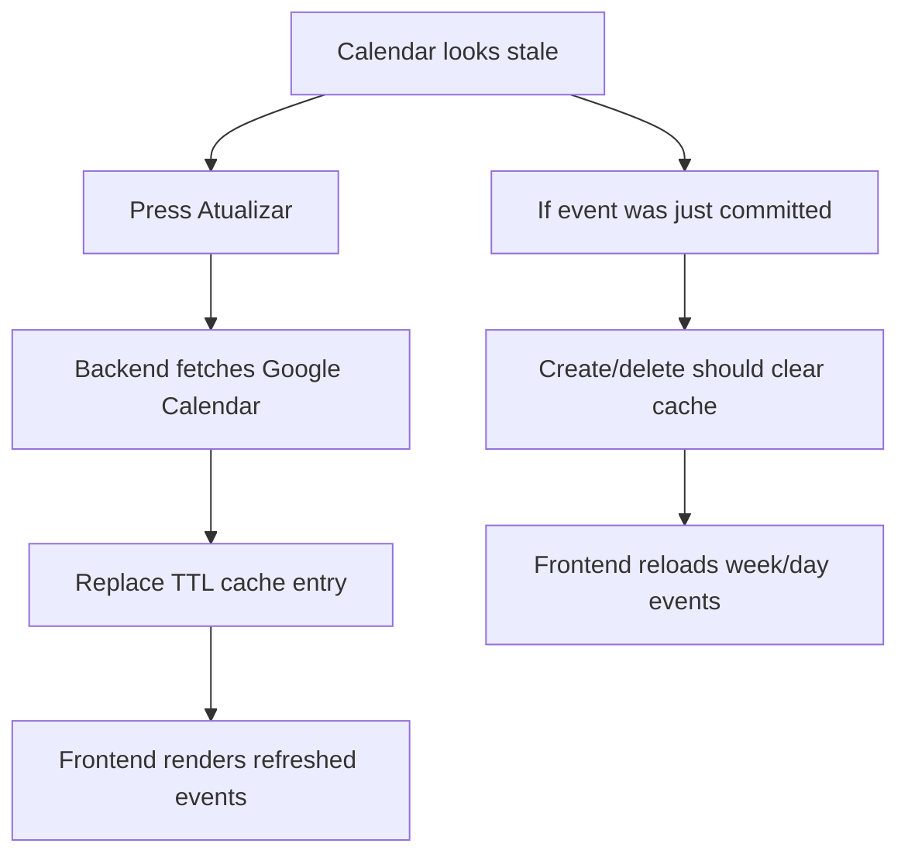

# Calendar Cache Diagnostic Flow

```mermaid
flowchart TD
  Start[Calendar looks stale] --> Refresh[Press Atualizar]
  Refresh --> Google[Backend fetches Google Calendar]
  Google --> Cache[Replace TTL cache entry]
  Cache --> UI[Frontend renders refreshed events]
  Start --> Commit[If event was just committed]
  Commit --> Clear[Create/delete should clear cache]
  Clear --> Reload[Frontend reloads week/day events]
```
