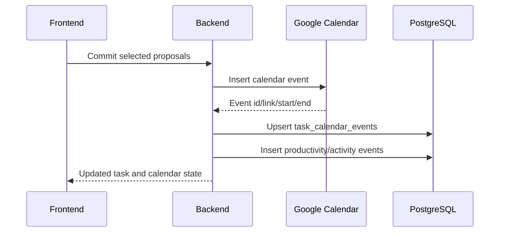

# Calendar Commit Sequence

```mermaid
sequenceDiagram
  participant UI as Frontend
  participant API as Backend
  participant GCal as Google Calendar
  participant DB as PostgreSQL

  UI->>API: Commit selected proposals
  API->>GCal: Insert calendar event
  GCal-->>API: Event id/link/start/end
  API->>DB: Upsert task_calendar_events
  API->>DB: Insert productivity/activity events
  API-->>UI: Updated task and calendar state
```
