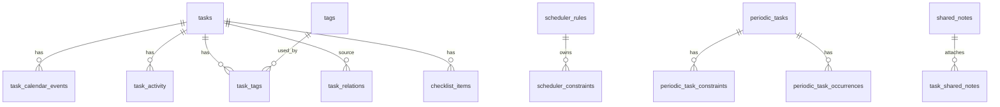

# Data Model ERD

```mermaid
erDiagram
  tasks ||--o{ task_calendar_events : has
  tasks ||--o{ task_activity : has
  tasks ||--o{ task_tags : has
  tags ||--o{ task_tags : used_by
  tasks ||--o{ task_relations : source
  tasks ||--o{ checklist_items : has
  scheduler_rules ||--o{ scheduler_constraints : owns
  periodic_tasks ||--o{ periodic_task_constraints : has
  periodic_tasks ||--o{ periodic_task_occurrences : has
  shared_notes ||--o{ task_shared_notes : attaches
```
