# Full Schema ERD

This is the most complete Mermaid view of the current app schema. It is derived from the Supabase migrations plus the legacy base tables that existed before the tracked migration set.

Note: Mermaid ER diagrams are useful for relationships, but they are not a perfect SQL DDL format. JSON/array/check details remain in [Schema Reference](../12-schema-reference.md).

```mermaid
erDiagram
  tasks {
    uuid id PK
    text title
    text notes
    integer priority
    text status
    timestamptz due_date_time
    integer estimated_minutes
    boolean is_favorite
    text requested_by
    text blocked_reason
    timestamptz completed_at
    timestamptz cancelled_at
    timestamptz archived_at
    timestamptz created_at
    timestamptz updated_at
  }

  task_checklist_items {
    uuid id PK
    uuid task_id FK
    text title
    boolean is_done
    integer position
    timestamptz created_at
    timestamptz completed_at
  }

  task_relations {
    uuid task_id PK
    uuid related_task_id PK
    task_relation_type relation_type PK
    timestamptz created_at
  }

  task_activity {
    uuid id PK
    uuid task_id FK
    activity_type type
    text message
    text from_status
    text to_status
    timestamptz created_at
    timestamptz edited_at
  }

  task_activity_revisions {
    uuid id PK
    uuid activity_id FK
    text message
    timestamptz replaced_at
  }

  tags {
    uuid id PK
    text name
    text normalized_name UK
    timestamptz deactivated_at
    timestamptz created_at
  }

  task_tags {
    uuid task_id PK
    uuid tag_id PK
  }

  shared_notes {
    uuid id PK
    text title
    text body
    timestamptz archived_at
    timestamptz created_at
    timestamptz updated_at
  }

  task_shared_notes {
    uuid task_id PK
    uuid note_id PK
    timestamptz created_at
  }

  shared_note_tags {
    uuid note_id PK
    uuid tag_id PK
  }

  task_calendar_events {
    uuid id PK
    uuid task_id FK
    text google_event_id UK
    text calendar_id UK
    text summary
    timestamptz start_at
    timestamptz end_at
    text html_link
    text review_status
    timestamptz reviewed_at
    text review_note
    jsonb review_feedback
    integer xp_delta
    timestamptz created_at
    timestamptz updated_at
  }

  scheduler_rules {
    uuid id PK
    text text
    text interpretation
    text status
    boolean enabled
    numeric confidence
    text model
    jsonb raw_response
    timestamptz created_at
    timestamptz updated_at
  }

  scheduler_constraints {
    uuid id PK
    uuid rule_id FK
    text type
    jsonb scope
    jsonb payload
    boolean hard
    boolean enabled
    timestamptz created_at
    timestamptz updated_at
  }

  scheduler_constraint_types {
    text type PK
    text label
    text description
    jsonb schema
    boolean enabled
    timestamptz created_at
    timestamptz updated_at
  }

  scheduler_schedule_batches {
    uuid id PK
    text status
    text source
    timestamptz created_at
    timestamptz committed_at
    timestamptz superseded_at
  }

  scheduler_reserved_blocks {
    uuid id PK
    uuid batch_id FK
    text type
    timestamptz start_at
    timestamptz end_at
    text reason
    uuid source_rule_id FK
    uuid source_constraint_id FK
    timestamptz created_at
  }

  periodic_tasks {
    uuid id PK
    text title
    text notes
    text_array tags
    integer priority
    integer estimated_minutes
    text period
    integer target_count
    jsonb hard_constraints
    jsonb preferences
    boolean active
    timestamptz created_at
    timestamptz updated_at
  }

  periodic_task_constraints {
    uuid id PK
    uuid periodic_task_id FK
    text type
    jsonb scope
    jsonb payload
    boolean hard
    boolean active
    timestamptz expires_at
    timestamptz created_at
    timestamptz updated_at
  }

  periodic_task_occurrences {
    uuid id PK
    uuid periodic_task_id FK
    timestamptz scheduled_start
    timestamptz scheduled_end
    text calendar_id
    text google_event_id
    text html_link
    text status
    timestamptz created_at
    timestamptz updated_at
  }

  advisor_feedback {
    uuid id PK
    text action
    text command_id
    text command_type
    uuid task_id FK
    text task_title
    text title_fingerprint
    jsonb feedback
    jsonb command_preview
    jsonb raw_command
    timestamptz created_at
  }

  advisor_memory_rules {
    uuid id PK
    text rule_type UK
    text title_fingerprint UK
    text action UK
    jsonb rule
    integer support_count
    timestamptz last_feedback_at
    timestamptz created_at
    timestamptz updated_at
  }

  google_connections {
    uuid id PK
    text account_email
    text_array scopes
    jsonb encrypted_tokens
    timestamptz expires_at
    timestamptz created_at
    timestamptz updated_at
  }

  google_oauth_states {
    text state PK
    timestamptz created_at
    timestamptz expires_at
  }

  quick_queue_items {
    uuid id PK
    text text
    boolean is_done
    integer position
    timestamptz created_at
    timestamptz updated_at
  }

  productivity_events {
    uuid id PK
    text event_type
    integer xp
    uuid task_id FK
    uuid quick_queue_item_id FK
    uuid checklist_item_id FK
    uuid calendar_event_id FK
    jsonb metadata
    timestamptz occurred_at
    timestamptz created_at
  }

  app_settings {
    text key PK
    jsonb value
    timestamptz created_at
    timestamptz updated_at
  }

  tasks ||--o{ task_checklist_items : has
  tasks ||--o{ task_activity : has
  task_activity ||--o{ task_activity_revisions : has
  tasks ||--o{ task_relations : source
  tasks ||--o{ task_relations : related
  tasks ||--o{ task_tags : has
  tags ||--o{ task_tags : applied_to
  tasks ||--o{ task_shared_notes : has
  shared_notes ||--o{ task_shared_notes : attached_to
  shared_notes ||--o{ shared_note_tags : tagged_with
  tags ||--o{ shared_note_tags : used_by

  tasks ||--o{ task_calendar_events : scheduled_as
  task_calendar_events ||--o{ productivity_events : awards_or_penalizes
  tasks ||--o{ productivity_events : records
  quick_queue_items ||--o{ productivity_events : records
  task_checklist_items ||--o{ productivity_events : records

  scheduler_rules ||--o{ scheduler_constraints : owns
  scheduler_rules ||--o{ scheduler_reserved_blocks : source_rule
  scheduler_constraints ||--o{ scheduler_reserved_blocks : source_constraint
  scheduler_schedule_batches ||--o{ scheduler_reserved_blocks : reserves

  periodic_tasks ||--o{ periodic_task_constraints : has
  periodic_tasks ||--o{ periodic_task_occurrences : schedules

  tasks ||--o{ advisor_feedback : receives_feedback
```

