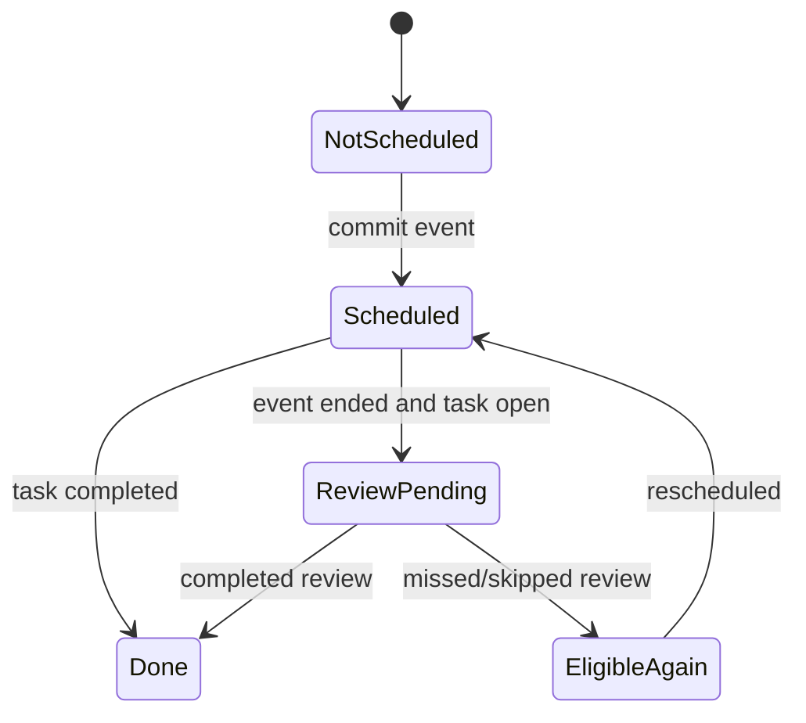

# Scheduled Review State Diagram

```mermaid
stateDiagram-v2
  [*] --> NotScheduled
  NotScheduled --> Scheduled: commit event
  Scheduled --> ReviewPending: event ended and task open
  Scheduled --> Done: task completed
  ReviewPending --> Done: completed review
  ReviewPending --> EligibleAgain: missed/skipped review
  EligibleAgain --> Scheduled: rescheduled
```
