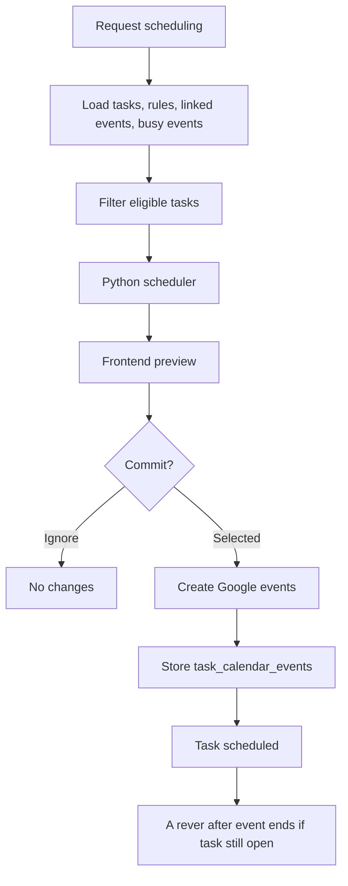

# Scheduling Flow Diagram

```mermaid
flowchart TD
  Start[Request scheduling] --> Load[Load tasks, rules, linked events, busy events]
  Load --> Eligible[Filter eligible tasks]
  Eligible --> Scheduler[Python scheduler]
  Scheduler --> Preview[Frontend preview]
  Preview --> Commit{Commit?}
  Commit -->|Ignore| End[No changes]
  Commit -->|Selected| Google[Create Google events]
  Google --> Link[Store task_calendar_events]
  Link --> Scheduled[Task scheduled]
  Scheduled --> Review[A rever after event ends if task still open]
```
