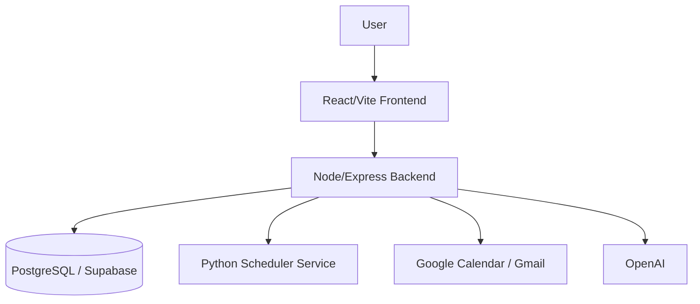

# System Context Diagram

```mermaid
flowchart TD
  User[User] --> FE[React/Vite Frontend]
  FE --> API[Node/Express Backend]
  API --> DB[(PostgreSQL / Supabase)]
  API --> Scheduler[Python Scheduler Service]
  API --> Google[Google Calendar / Gmail]
  API --> OpenAI[OpenAI]
```
