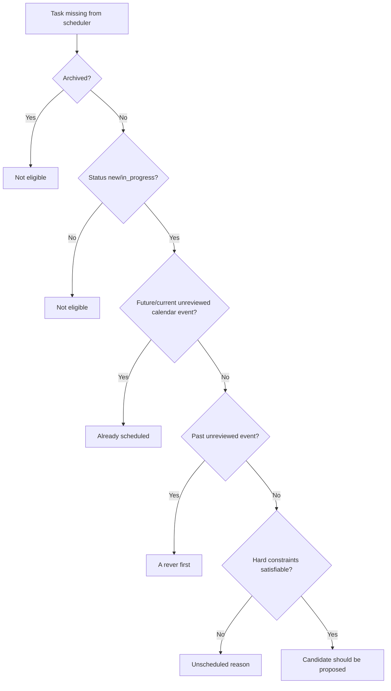

# Task Not Eligible Flow

```mermaid
flowchart TD
  Start[Task missing from scheduler] --> Archived{Archived?}
  Archived -->|Yes| StopArchived[Not eligible]
  Archived -->|No| Status{Status new/in_progress?}
  Status -->|No| StopStatus[Not eligible]
  Status -->|Yes| ActiveEvent{Future/current unreviewed calendar event?}
  ActiveEvent -->|Yes| StopScheduled[Already scheduled]
  ActiveEvent -->|No| Review{Past unreviewed event?}
  Review -->|Yes| NeedsReview[A rever first]
  Review -->|No| Constraints{Hard constraints satisfiable?}
  Constraints -->|No| Rejected[Unscheduled reason]
  Constraints -->|Yes| Proposed[Candidate should be proposed]
```
